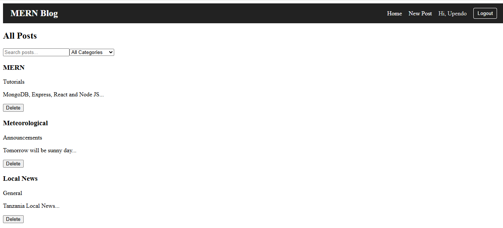
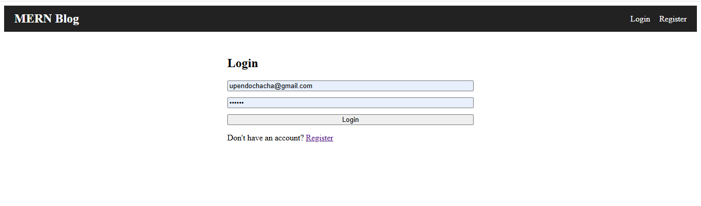
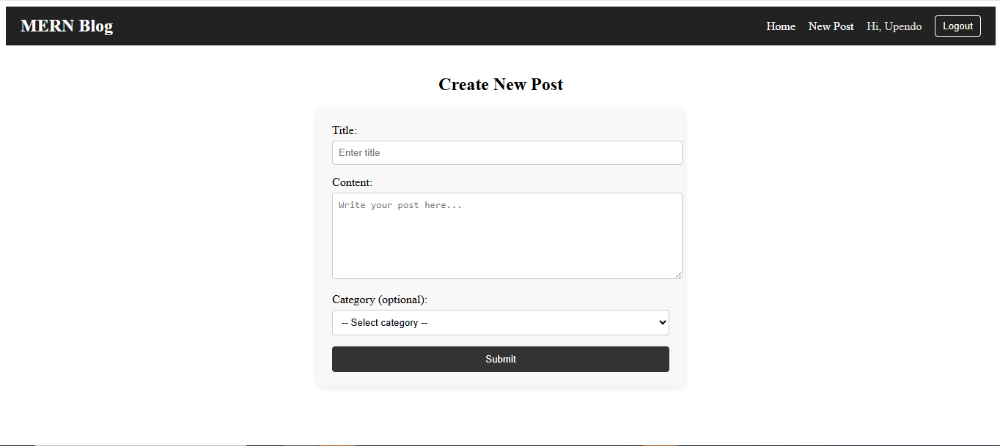

# 📰 MERN Blog Application

## 🔄 Week 4: Deep Dive into MERN Stack Integration

### 🚀 Objective
Build a full-stack **MERN (MongoDB, Express.js, React.js, Node.js)** application that demonstrates seamless integration between front-end and back-end components, including database operations, API communication, and state management.

---

## 📂 Project Structure

mern-blog/


├── client/ # React front-end


│ ├── public/ # Static files


│ └── src/ # React source code


│ ├── components/ # Reusable UI components


│ ├── pages/ # Page components


│ ├── hooks/ # Custom React hooks


│ ├── services/ # API service layer


│ ├── context/ # Context providers (state)


│ └── App.jsx # Main React app component

│
├── server/ # Express.js back-end


│ ├── config/ # Database configuration


│ ├── controllers/ # Route controllers


│ ├── models/ # Mongoose models


│ ├── routes/ # API route definitions


│ ├── middleware/ # Custom middlewares


│ ├── utils/ # Utility/helper functions


│ └── server.js # Main server entry point
│

├── .gitignore # Git ignore rules


├── package.json # Root dependency info


├── Home.PNG # Screenshot - Home Page


├── Login.PNG # Screenshot - Login Page


├── Posts.PNG # Screenshot - Posts Page


└── README.md # Project documentation


---

## 🧩 Screenshots

| Section | Screenshot |
|----------|-------------|
| 🏠 Home Page |  |
| 🔐 Login Page |  |
| 📝 Posts Page |  |

---

## 📘 Tasks Overview

### **Task 1: Project Setup**
- Configure folder structure for both client and server.
- Connect MongoDB with Mongoose.
- Setup Express.js server with CORS, body-parser, and dotenv.
- Create React front-end using Vite.
- Configure `.env` files for client and server.

### **Task 2: Back-End Development**
- RESTful API endpoints:
  - `GET /api/posts` → Get all blog posts  
  - `GET /api/posts/:id` → Get one post  
  - `POST /api/posts` → Create a new post  
  - `PUT /api/posts/:id` → Update an existing post  
  - `DELETE /api/posts/:id` → Delete a post  
  - `GET /api/categories` → Get all categories  
  - `POST /api/categories` → Create a new category  
- Create `Post` and `Category` models using Mongoose.  
- Validate inputs using `express-validator`.  
- Add global error handling middleware.

### **Task 3: Front-End Development**
- Build React components for:
  - Post List  
  - Single Post  
  - Create/Edit Post Form  
  - Navigation Bar and Layout  
- Use React Router for navigation.  
- Use `useState`, `useEffect`, and `useContext` for state management.  
- Create a custom API service for backend communication.

### **Task 4: Integration and Data Flow**
- Connect front-end and back-end using Axios.  
- Implement API service (`client/src/services/api.js`).  
- Handle form submission, loading, and error states.  
- Display success/failure messages.  
- Ensure posts update dynamically in the UI.

### **Task 5: Advanced Features (Optional)**
- Add authentication (login/register).  
- Implement image uploads for posts.  
- Add pagination and search.  
- Add comments section for blog posts.

---

## ⚙️ Setup & Installation

### 1️⃣ Prerequisites
- **Node.js** (v18 or higher)
- **MongoDB** (local or Atlas)

### 2️⃣ Clone Repository
```bash
git clone https://github.com/yourusername/mern-blog.git
cd mern-blog


3️⃣ Install Server Dependencies
cd server
npm install


4️⃣ Install Client Dependencies
cd ../client
npm install


5️⃣ Environment Variables

server/.env

PORT=5000
MONGO_URI=mongodb://localhost:27017/mern_db


client/.env

VITE_API_BASE_URL=http://localhost:5000/api


6️⃣ Start Development Servers
# In server
npm run dev

# In client
npm run dev


Visit:
🖥️ Front-end → http://localhost:5173

⚙️ API → http://localhost:5000/api


